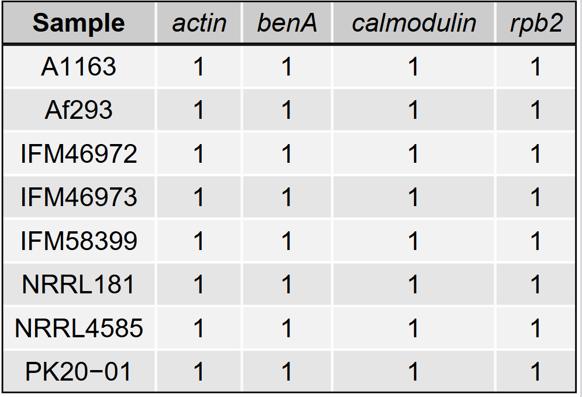
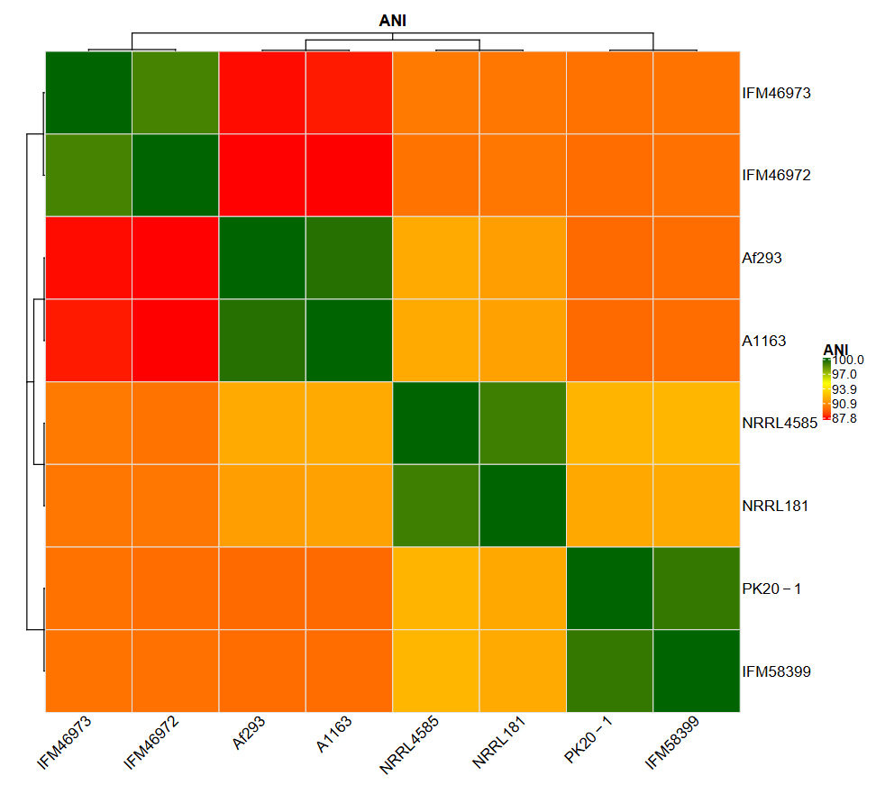

# Outputs

The workflow generates quality control reports, extracted gene sequences,
alignments, phylogenetic trees, ANI analyses, and logs.

## Output overview

The workflow output structure is shown below:

```text
results/
|-- QC/
|   |-- quast/
|   |   \-- {sample}.pdf
|   |-- ref_genes.validated
|   |-- gene-qc-detail.tsv
|   |-- gene-qc-matrix.tsv
|   |-- gene-qc-matrix.pdf
|   \-- genome-list-pass.txt
|
|-- genes/
|   |-- map-pool/
|   |   |-- map-pool.fas
|   |   \-- map-pool.filtered.fas
|   |-- aligned/
|   |   \-- {gene}.fas
|   |-- deduplicated/
|   |   \-- {sample}.fas
|   |-- join-fragments/
|   |   \-- {sample}.fas
|   \-- concat/
|       |-- concat.fas
|       |-- concat.tab
|       \-- concat.part
|
|-- phylogenetics/
|   |-- MLSA.nwk
|   |-- iqtree/
|   |-- raxml/
|   \-- fasttree/
|
\-- ANI/
    |-- skani/
    |-- fastani/
    \-- pyani/

resources/
|-- db/
|   \-- ref-genes.validated.fas
\-- public_genomes/

logs/

report.html
```

> Only directories and files relevant to the configured `tree.method` and
> `ani_method` will be generated (see [Configuration](configuration.md)).


## Quality control outputs

### Reference gene validation

`resources/db/ref-genes.validated.fas` is the cleaned reference FASTA used
throughout the workflow. Validation checks for correct `>{strain}|{gene}`
header format, whitespace normalization, and unique `strain|gene` identifiers.

A validation marker is written to `results/QC/ref_genes.validated`:

- If duplicate identifiers or invalid headers are found, an error is reported
  and the workflow stops. Details are written to
  `logs/ref_genes_validation.log`.
- Otherwise the file contains `OK`.

### QUAST assembly statistics

`results/QC/quast/{sample}.pdf` contains per-genome assembly quality
statistics generated by QUAST, including:

- Total assembly length (bp)
- Number of contigs
- N50 (bp)
- GC content (%)

One PDF is produced per sample. These results can be used to identify
low-quality assemblies before downstream analysis.

### Gene quality control

#### Detailed QC table

`results/QC/gene-qc-detail.tsv` contains one row per sample-gene combination.

| Column | Description |
|---|---|
| `Sample` | Genome/sample name |
| `Gene` | Locus name |
| `Copies` | Number of copies detected |
| `Length` | Extracted sequence length (bp) |
| `RefLength` | Reference gene length (bp) |
| `LengthRatio` | Extracted length / reference length |
| `Coverage` | Alignment coverage |
| `Similarity` | Alignment similarity |

A hit is classified as fragmented when `Coverage` < 0.95 or
`LengthRatio` < 0.90.

#### Copy number matrix

`results/QC/gene-qc-matrix.tsv` provides a gene x sample copy number matrix.
Values represent the integer number of copies detected per locus per genome
(0 = absent).

`results/QC/gene-qc-matrix.pdf` renders this table as a PDF.



#### Passing genomes

`results/QC/genome-list-pass.txt` lists the file paths of all genomes that
passed gene QC (all target loci present as a single, unfragmented copy). Only
these genomes are used for MLSA alignment and ANI analysis.


## Extracted genes

### Combined gene dataset

- `results/genes/map-pool/map-pool.fas` — all extracted loci from all samples
- `results/genes/map-pool/map-pool.filtered.fas` — loci from QC-passing
  genomes only; used as input for alignment

### Fragment-joined sequences

`results/genes/join-fragments/{sample}.fas` contains extracted loci after
fragmented hits from the same locus have been merged where possible. 
Sequences that could not be joined remain as separate fragmented entries and
are carried forward for QC classification.

### Deduplicated sequences

`results/genes/deduplicated/{sample}.fas` contains the output after exact
duplicate sequences have been removed within each sample. Where multiple
identical sequences exist for the same locus, the first occurrence is kept.

### Multiple sequence alignments

`results/genes/aligned/` contains one MUSCLE alignment per locus:

```text
results/genes/aligned/actin.fas
results/genes/aligned/calmodulin.fas
results/genes/aligned/rpb2.fas
results/genes/aligned/benA.fas
```

### Concatenated alignment

`results/genes/concat/concat.fas` is the MLSA supermatrix used for
phylogenetic inference.

### Partition information

- `results/genes/concat/concat.tab` — per-locus boundary table produced by
  `fasta_autoconcatenate`
- `results/genes/concat/concat.part` — partition file in RAxML/IQ-TREE format,
  generated from the boundary table


## Phylogenetic outputs

### Final tree

`results/phylogenetics/MLSA.nwk` is the primary phylogenetic output: a
midpoint-rerooted Newick tree suitable for visualization with tools such as
iTOL, FigTree, or ggtree.

### Method-specific outputs

Only the directory corresponding to the configured `tree.method` is generated.

| Method | Directory | Key outputs |
|---|---|---|
| IQ-TREE | `results/phylogenetics/iqtree/` | `iqtree.treefile`, `iqtree.ckp.gz`, model and bootstrap files |
| RAxML | `results/phylogenetics/raxml/` | `RAxML_bestTree.analysis-bs`, `RAxML_bootstrap.analysis-bs`, `RAxML_bipartitions.analysis-ML-bs` |
| FastTree | `results/phylogenetics/fasttree/` | `fasttree.nwk` |


## ANI outputs

ANI outputs are only generated when `ani_method` is not set to `none`.

### skani

- `results/ANI/skani/skani_pairs.tsv` — raw pairwise ANI output
- `results/ANI/skani/skani_table.tsv` — symmetric ANI matrix
- `results/ANI/skani/skani.pdf` — MLSA tree combined with ANI heatmap

### FastANI

- `results/ANI/fastani/fastani_pairs.tsv` — raw pairwise ANI output
- `results/ANI/fastani/fastani_table.tsv` — symmetric ANI matrix
- `results/ANI/fastani/fastani.pdf` — MLSA tree combined with ANI heatmap

### pyani

- `results/ANI/pyani/ANIm_percentage_identity.tab` — percentage identity matrix
- `results/ANI/pyani/ANIm_alignment_coverage.tab` — alignment coverage matrix
- `results/ANI/pyani/pyani_dist.phy` — distance matrix in PHYLIP format
- `results/ANI/pyani/pyani_dist.nwk` — neighbour-joining tree inferred from
  the distance matrix
- `results/ANI/pyani/pyani_percentage_identity_plot.pdf` — NJ tree combined
  with percentage identity heatmap
- `results/ANI/pyani/pyani_cov_plot.pdf` — NJ tree combined with alignment
  coverage heatmap




## Public genomes

When `accessions` is set in `config.yaml`, downloaded assemblies are stored in
`resources/public_genomes/{sample}.fna` and processed identically to local
genomes throughout the workflow.


## Logs

`logs/` contains log files for all workflow steps, organized by rule. These
are the first place to check when troubleshooting a failed run.

## Snakemake report

An interactive HTML summary report can be generated after a successful run:

```bash
snakemake --cores 10 --report report.html
```

`report.html` is a self-contained file that includes:

- A workflow graph showing rule dependencies
- All outputs marked with `report(...)` in the workflow (QUAST PDFs,
  gene QC matrix PDF, and ANI heatmap PDFs), embedded and viewable directly
  in the browser
- Runtime statistics for the run

The report is organized into the following sections:

| Section | Contents |
|---|---|
| General/Workflow | Workflow graph and pipeline description |
| General/Statistics | Per-rule runtime statistics |
| Results/QC | QUAST assembly reports and gene presence/absence matrix |
| Results/ANI | ANI heatmap(s) for the configured method |